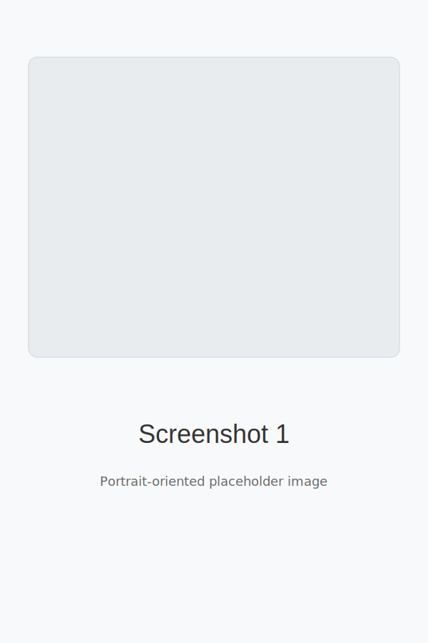
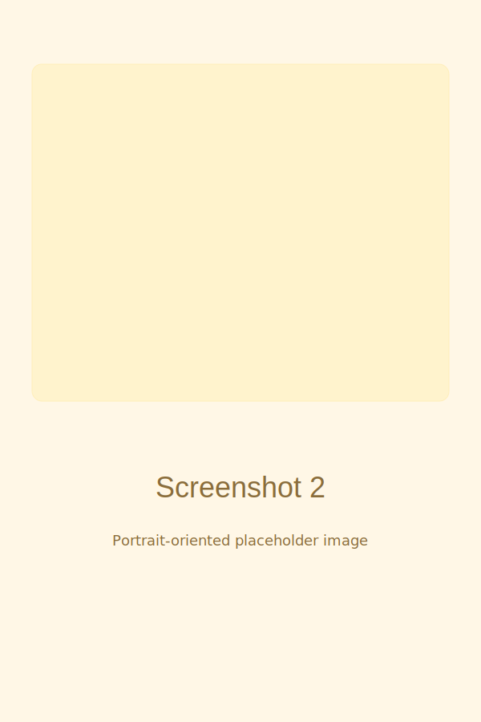
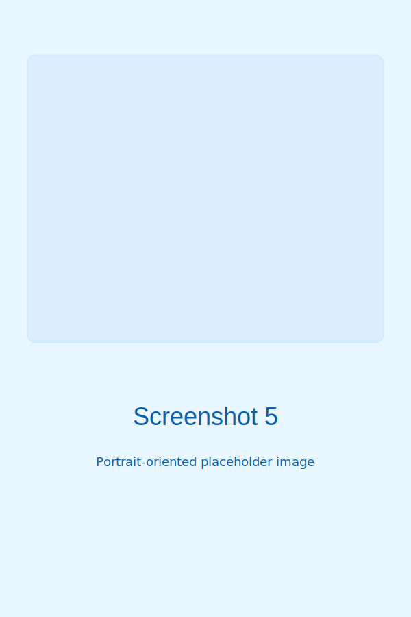
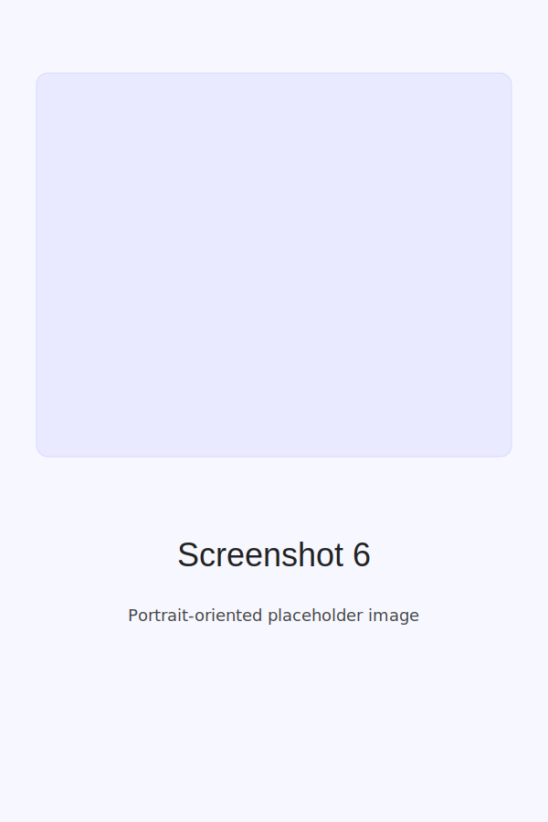

# Bookstore

Bookstore Website using Spring Boot and Rest api for backend and html, css and JavaScript for frontend.

## About

This repository contains a Bookstore web application built with Spring Boot for the backend (REST API) and a simple frontend using HTML, CSS, and JavaScript. It provides features to list books, add new books, update existing books, and delete books.

## Languages

- Java (backend)
- JavaScript (frontend logic)
- CSS
- HTML

## Features

- RESTful API with Spring Boot
- CRUD operations for books
- Simple responsive frontend (HTML/CSS/JS)
- Example screenshots included

## Setup

Prerequisites:

- Java 11+ or compatible JDK
- Maven
- (Optional) MySQL or H2 database

Steps:

1. Clone the repository:

   git clone https://github.com/Vivek-krPatel/bookstore.git

2. Import the project into your IDE (IntelliJ/Eclipse) as a Maven project.
3. Configure database settings in src/main/resources/application.properties (if using MySQL).
4. Run the application:

   mvn spring-boot:run

5. Open the frontend in your browser (if applicable) or access API endpoints at http://localhost:8080/api

## API (example endpoints)

- GET /api/books - list all books
- GET /api/books/{id} - get a book by id
- POST /api/books - create a new book
- PUT /api/books/{id} - update a book
- DELETE /api/books/{id} - delete a book

(Adjust according to your actual controller mappings.)

## Screenshots

Below are portrait-oriented placeholder screenshots that were added to the images/ folder. The original landscape screenshots were rotated to portrait orientation and saved as SVG placeholders here.

## Notes on images

- Filenames intentionally include spaces as requested: "screenshot 1", "screenshot 2", "screenshot 5", "screenshot 6".
- The images are portrait-oriented SVG placeholders (600x900) so they appear vertically rather than horizontally.
- If you provide the original screenshots, I can rotate and replace these SVG placeholders with the corrected images (JPEG/PNG).

## License

This project is provided under the MIT License. See LICENSE for details.
